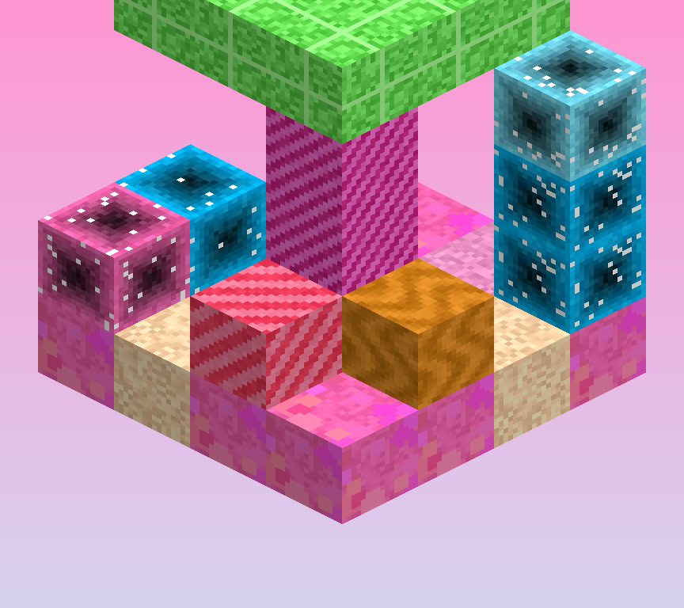

# Candy Infection

A colourful plague for **Minecraft Java Edition 1.21.1** (Fabric).

The infection is not grey rot or black slime. It is bubblegum pink grass, magenta
stone, gummy forests, caramel swamps and fields of sugar crystal — bright,
surreal and *very* hostile. It spreads block by block, builds structures and
nests, turns vanilla mobs, infects players, and eventually produces a boss, **The
Confectioner**, that you have to beat back.

Stage 7 does **not** delete your world. It makes the colony behave like a
world-ending ecosystem and hands you a fight.

---

## Install

1. **Install Fabric.** Download the Fabric installer from
   <https://fabricmc.net/use/installer/> and run it for Minecraft **1.21.1**.
2. **Install Fabric API.** The mod needs Fabric API
   (`0.116.17+1.21.1` or newer) from <https://modrinth.com/mod/fabric-api>.
3. **Download the mod jar.** Get `candyinfection-1.0.0-1.21.1.jar` — see
   [Building](#building) or download the `Candy-Infection-1.21.1` artifact from
   the latest successful [Actions run](https://github.com/benluvzbacon/Minecraft-infection-mod/actions).
4. **Put both jars in your `mods` folder** (`.minecraft/mods`).
5. **Launch** the Fabric 1.21.1 profile.
6. **Create or open a world.** The mod works in new *and* existing worlds: it
   never rewrites chunks it has not touched, so loading an old save is safe.

The infection starts dormant. It only begins once an **Infection Core** exists —
place one with `/candyinfection core`, or let one appear as the colony grows.

## Preview



A few of the registered blocks — infected grass and sand, gummy log and leaves,
hard candy, sugar crystal, a lollipop and caramel — rendered isometrically.
This is **not a gameplay screenshot**: this repository's CI has no Minecraft
client, no display and no network access to Mojang's asset servers, so a real
launch is impossible here. Instead this image is generated by
`tools/render_preview.py`, which decodes the *actual textures that ship in the
jar* and projects them onto cube faces, so it shows the real in-game art.
Regenerate it any time with `python3 tools/render_preview.py`.

### Server install

Drop the same two jars into the server's `mods` folder. The mod is
side-agnostic: spreading, infection levels, cores, nests, progression and the
boss are all server-authoritative and synced to clients with a custom payload.
Clients without the mod cannot join; clients with it get the infection HUD.

---

## Commands

`/candyinfection <subcommand>`. Read-only subcommands work for everyone;
anything that changes the world requires **permission level 2** (op).

| Command | What it does |
|---|---|
| `status` | World stage, infected-block count, cores, nests, monsters vs cap, your infection level, nearest core and nest |
| `stage` / `stage <1-7>` | Show or force the world infection stage |
| `spread <radius>` | Force-convert blocks in a radius around you |
| `cure me` / `cure <player...>` | Fully cure players |
| `infect <amount>` / `infect <player...> <amount>` | Add infection to players |
| `spawn <mob> [count]` | Spawn a candy monster near you (tab-completes) |
| `core [pos]` | Place an Infection Core |
| `purge <radius>` | Start a purge that reverts infection around you |
| `locate` | Nearest core, nearest nest, whether you are in Infected Land |
| `event <name>` | Start an event now: `candy_bloom`, `sugar_storm`, `infection_surge`, `gummy_migration`, `candyfall` |
| `structure <kind>` | Build one of the candy structures at your position |
| `config show` / `config reload` | Print or re-read `config/candyinfection.json` |
| `test` | Build a small self-contained infection zone: converted ground, a nest and a few monsters. Clean up with `/candyinfection purge 16` |

---

## Configuration

Written to `config/candyinfection.json` on first launch and re-read with
`/candyinfection config reload` — no restart needed. Values are clamped to safe
ranges on load.

| Key | Default | Meaning |
|---|---|---|
| `spreadEnabled` | `true` | Master switch for spreading |
| `spreadSpeedMultiplier` | `1.0` | Multiplies every spread chance |
| `baseSpreadChance` | `0.18` | Chance per spread attempt |
| `maxSpreadOperationsPerTick` | `24` | **Performance budget** — spread work per tick per dimension |
| `maxSpreadQueueSize` | `8192` | Cap on queued spread work; beyond this, work is dropped |
| `maxInfectionRadius` | `1024` | How far from a core the infection may travel |
| `infectedBlockTickRate` | `1` | Random-tick divisor for infected blocks |
| `monsterSpawningEnabled` | `true` | Add candy monsters to vanilla biome spawn tables |
| `monsterSpawnMultiplier` | `1.0` | Scales the monster cap |
| `maxCandyMonsters` | `90` | Hard cap per dimension, scaled by stage |
| `maxGummySpawns` | `60` | Separate cap for cheap swarm units |
| `structuresEnabled` | `true` | Let the infection build structures and nests |
| `worldGenEnabled` / `worldGenFrequency` | `true` / `1.0` | Candy region growth |
| `playerInfectionEnabled` | `true` | Whether players can be infected at all |
| `infectionPerAttack` | `4.0` | Infection added per monster hit |
| `infectionPerSecondInColony` | `0.35` | Passive infection while inside Infected Land |
| `naturalInfectionDecayPerSecond` | `0.05` | Passive recovery outside colonies |
| `infectionDamageMultiplier` | `1.0` | Scales infection damage to the player |
| `infectionDecayEnabled` | `true` | Allow purges to revert infection |
| `infectVanillaMobs` | `true` | Let vanilla mobs be infected and turned |
| `vanillaMobBlacklist` | `[]` | Entity ids that may never be infected |
| `vanillaMobInfectionTicks` / `vanillaMobInfectionChance` | `1800` / `0.25` | How fast and how often mobs turn |
| `eventsEnabled` | `true` | The five infection events |
| `bossSpawningEnabled` | `true` | Whether The Confectioner can spawn |
| `difficultyScalingEnabled` | `true` | Scale variety/frequency/abilities instead of raw HP |
| `secondsPerStage` | `1500` | Time per stage once the infection is active |
| `hudEnabled` | `true` | Show the on-screen infection meter |
| `debugLogging` | `false` | Extra logging (never per-tick) |

---

## Mechanics

### Spreading

Infected blocks push their position onto a **bounded per-dimension queue** when
they random-tick. Each server tick the runtime drains at most
`maxSpreadOperationsPerTick` entries and tests a handful of neighbours against
the conversion table. There is **no chunk scanning** and no full-block sweep, so
a 10,000-block colony costs the same per tick as a 100-block one.

Grass, dirt, stone, sand, gravel, wood, leaves and crops all convert into
distinct candy blocks. Progression runs through **7 stages**; later stages
convert faster and unlock more monster variety rather than more health.

### Infected Land

A chunk with enough infected neighbours counts as a colony. Inside one you get
ambient particles, more spawns, candy vegetation, and passive infection.
Standing in a colony is what the HUD is telling you about.

Regions grow into one of six flavours, chosen deterministically from the chunk
coordinates so a given area always looks the same: **Gummy Forest**, **Chocolate
Wasteland**, **Sugar Crystal Fields**, **Caramel Swamp**, **Candy Plains** and
**Deep Candy Caverns**.

Structures (gummy groves, hard-candy arches, chocolate mounds, sugar spires,
lollipop fields) and **infection nests** are built procedurally as the infection
advances. They are only ever built inside already-loaded chunks, so existing
worlds are never modified behind your back and nests can be purged cleanly.

### Monsters

| Monster | Gimmick |
|---|---|
| **Candy Crawler** | Spider-like; faster on infected ground, sheds gummy spawns, converts soil on hit |
| **Gummy Spawn** | Cheap swarm unit, deliberately excluded from the main cap so it can flood |
| **Gummy Brute** | 80 HP charge attack that smashes foliage and leaves infected ground behind |
| **Sugar Leech** | Drains hunger, applies Sugar Craving, double infection on hit |
| **Candy Mimic** | Disguised as a candy block until you get within ~3.5 blocks, then lunges |
| **Caramel Beast** | Fireproof, sticky aura, lobs candy projectiles |
| **Jawbreaker** | Rolling charge that speeds up, breaks grass and glass, splits into gummy spawns on death |
| **Chocolate Creeper** | Short fuse, then an infection blast that converts the ground |
| **Lollipop Stalker** | Blinks toward you from 64 blocks and releases an infection wave |
| **The Confectioner** | 420 HP boss, 5 phases at 80/60/40/20% health |

Boss attacks: projectile barrages, summons, caramel traps, sugar spikes, a
chocolate explosion and a wide infection wave. Killing it drops Chocolate Cores,
Holy Sugar, Purification Crystals, Candy Essence and a **Confectioner Trophy**,
then starts a large purge and resets the boss flag so it can return.

### Player infection

0–100%, in five tiers with escalating effects: hunger drain, slowness, nausea,
stumbling, and at 100% real danger. Infection persists across deaths and
restarts.

**Cures** (expensive but always achievable):

- **Purification Potion** — cheap, −25%
- **Anti-Candy Syringe** — expensive, −60% plus temporary immunity
- **Purification Crystal** — crafting material for both
- **Purifier block** — refuel with candy materials, it reverts infection in a
  7-block radius continuously
- **Holy Sugar** — endgame cure, crafted from essence, crystals and hardened sugar

### Equipment

Tools and armour in three tiers — **Candy**, **Hardened Sugar** and
**Confectioner**. They are deliberately *not* stronger than Netherite: the top
tier trades raw attack damage for durability and an infection-specific payoff
(candy armour actively scrubs infection off the wearer, candy tools drop extra
material from infected blocks, the Caramel Blade can purify what it breaks).

Weapons: Sugar Sword, Jawbreaker Mace, Candy Bow (no ammo needed), Gummy Spear
(lunge attack), Chocolate Hammer and Caramel Blade. The **Candy Hammer** and
**Chocolate Hammer** break a 3×3 area.

### Infection Core

The core is unbreakable until you chew through its shield, in **4 stages**
(120 points per stage). Destroying it triggers a large purge that reverts the
surrounding land over time — this is the main way to take territory back.

### Events

`candy_bloom` (burst growth), `sugar_storm` (falling crystals),
`infection_surge` (double spread rate), `gummy_migration` (swarm waves) and
`candyfall`. Each is short-lived and local, with a cooldown between them.

---

## Performance

- No chunk scanning, ever. Spread is queue-driven with a per-tick budget.
- Bounded queues, bounded nest list, hard monster caps scaled by stage.
- Monster counts are cached and refreshed every 5 seconds rather than counted
  per tick.
- Logging is coarse. Nothing logs per tick.

---

## Building

You need **JDK 21**.

```bash
./gradlew build
```

The jar lands at `build/libs/candyinfection-1.0.0-1.21.1.jar`.

Regenerate assets after changing the block/item tables:

```bash
python3 tools/generate_textures.py    # procedural PNGs, stdlib only
python3 tools/generate_resources.py   # blockstates, models, lang, recipes, loot, tags
python3 tools/check_sources.py        # structural + cross-reference lint
python3 tools/check_resources.py      # resource <-> registry consistency
```

### CI

`.github/workflows/build.yml` runs on every push: checkout → validate the Gradle
wrapper → JDK 21 (Temurin) → set up Gradle → `./gradlew build` → verify the jar
contains `fabric.mod.json`, the compiled classes and assets, plus eight named
classes and at least 60 class files → upload the artifact
**`Candy-Infection-1.21.1`**.

On failure, `tools/report_build_errors.py` re-joins each javac diagnostic into a
single readable annotation with its symbol and location.

[](https://github.com/benluvzbacon/Minecraft-infection-mod/actions/workflows/build.yml)

---

## Project layout

```
src/main/java/dev/candyinfection/
  CandyInfection.java          common entrypoint
  block/                       28 candy blocks + block entities
  command/                     /candyinfection
  config/                      JSON config
  effect/                      5 status effects
  entity/                      11 entity types (+ goals)
  infection/                   spread engine, stages, events, player infection
  init/                        registries
  item/                        tools, armour, food, cures
  network/                     infection sync payload
  util/                        logging
  world/gen/                   regions, structures, spawn wiring
src/client/java/dev/candyinfection/client/
                               renderers, particles, HUD, payload receiver
src/main/resources/            textures, models, blockstates, lang, recipes,
                               loot tables, tags, fabric.mod.json
tools/                         asset generators and checkers
```

## License

MIT — see [LICENSE](LICENSE).
